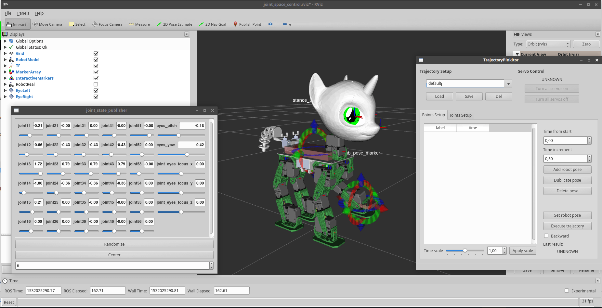

Sweetie Bot software repository 
===================================

This repository contains software framework for the [Sweetie Bot Proto2 robot](http://sweetie.bot).



Build status               | master branch  | devel branch
---------------------------|----------------|----------------
ros-lunar-sweetie-bot-base | [](https://gitlab.com/slavanap/ros-build/pipelines) | 
ros-lunar-sweetie-bot      | [](https://gitlab.com/sweetie-bot/sweetie_bot/commits/master) | [](https://gitlab.com/sweetie-bot/sweetie_bot/commits/devel)

## Overview

Sweetie Bot software is based on [Robot Operating System (ROS)](http://wiki.ros.org/ROS/Introduction). Also it uses [OROCOS](http://www.orocos.org/wiki/orocos/toolchain/getting-started) middleware to implement real-time motion control subsystem. See [`sweetie_bot_deploy`](config/sweetie_bot_deploy) and  [`rt_control`](rt_control) for more details (namespaces, nodes, configuration parameters).

Sweetie Bot software support two modes: real and virtual. 
1. In a virtual mode it runs completely on the host computer. The real robot is not needed. You can program robot behaviors in a virtual enviroment (3d model). 
2. In a real mode it controls the real robot. One part of software runs the host computer and another part works the on-board computer. 

Current version of Sweetie Bot software provides following functionality:
1. Joint level control using [`joint_state_publisher`](http://wiki.ros.org/joint_state_publisher).
2. The control in Cartesian space (for the limbs and the body) using [pose markers](hmi/sweetie_bot_rviz_interactions) and [MoveIt!](https://moveit.ros.org/) integration.
3. Movements creation (See [TrjectoryEditor](hmi/sweetie_bot_joint_trajectory_editor))
4. High-level control based on [FlexBe](http://philserver.bplaced.net/fbe/) hybrid finite state machines via external repository [`sweetie_bot_flexbe_behaviors`](https://gitlab.com/sweetie-bot/sweetie_bot_flexbe_behaviors).

## Repository content

This repository contains all necessary software components to run the Sweetie Bot robots except for movements, sounds and actual behaviors which are stored in separate repositories
([`sweetie_bot_proto2_movements`](https://gitlab.com/sweetie-bot/sweetie_bot_proto2_movements), [`sweetie_bot_sounds`](https://gitlab.com/sweetie-bot/sweetie_bot_sounds) and 
[`sweetie_bot_flexbe_behaviors`](https://gitlab.com/sweetie-bot/sweetie_bot_flexbe_behaviors).

* [`config`](config) directory contains robot configuration and deployment scripts
    * `sweetie_bot_deploy` --- robot-independent OROCOS deployment scripts and ROS launch files.
	* `sweetie_bot_proto2_deploy` --- robot-specific parameters and launch files for Proto2 Sweetie Bot robot.
	* `sweetie_bot_proto2_description` --- URDF model of Proto2 (git submodule).
	* `sweetie_bot_proto2_moveit_config` --- MoveIt! configuration for Proto2.
* [`rt_control`](https://gitlab.com/sweetie-bot/sweetie_bot_rt_control) --- OROCOS-based motion control subsystem (git submodule).
* [`hardware`](hardware) --- hardware-depended components.
    * `sweetie_bot_eyes` --- eyes visualization.
* [`behavior`](behavior) --- high-level control subsystem (not implemented yet).
* [`hmi`](hmi) --- operator interface components, intended to be running on the host computer.

## Installation

#### Project dependencies

Internal dependencies:

* [`sweetie_bot_proto2_movements`](https://gitlab.com/sweetie-bot/sweetie_bot_proto2_movements) --- stored movements for Proto2,
* [`sweetie_bot_sounds`](https://gitlab.com/sweetie-bot/sweetie_bot_sounds) --- sound package.

External dependencies:

* [ROS Kinetic Kame](http://wiki.ros.org/kinetic/Installation) or later. We need following packages:
    * `ros_base` --- basic ROS installation.
	* MoveIt! packages.
    * `eigen-conversions`, `tf-conversions`, `interactive-markers`.
	* `orocos_kdl` and `track_ik` kinematics packages.
	* [`rospy_message_converter`](https://github.com/baalexander/rospy_message_converter)
	* [`rviz_textured_quads`](https://github.com/lucasw/rviz_textured_quads)
* [OROCOS 2.9](https://github.com/orocos-toolchain/orocos_toolchain), it is recommended slightly modified version from [here](https://github.com/disRecord) with improved lua completion. Also ROS package may be used but it may have some limitation. 
* Additional ROS packages
    * [`rtt-ros-integration` 2.9](https://github.com/orocos/rtt_ros_integration) (You may use ROS packages).
    * [`kdl_msgs`](https://github.com/orocos/kdl_msgs), [rtt_kdl_msgs](https://github.com/orocos/rtt_kdl_msgs), [`rtt_geometry`](https://github.com/orocos/rtt_geometry).
    * [`rttlua_completion`](https://github.com/orocos-toolchain/rttlua_completion), рекомендуется модифицированная версия [отсюда](https://github.com/disRecord)
    * `rtt_tf2_msgs`,`rtt_control_msgs` typekit packages can be generated with [`rtt_roscom`](https://github.com/orocos/rtt_ros_integration/tree/toolchain-2.9/rtt_roscomm)
* [Rigid Body Bynamics Library 2.5](https://rbdl.bitbucket.io/). Note that 2.6 version is not supported due changed quaternion semantic.
* [ALGLIB library](http://www.alglib.net) you may use package `libalglib-dev`)
* [FlexBe](http://philserver.bplaced.net/fbe/) behavior framework.
	* [`flexbe_behavior_engine`](https://github.com/team-vigir/flexbe_behavior_engine/tree/feature/flexbe_app), specifically `feature/flexbe_app` branch for `felxbe_app` support.
	* [`flexbe_app`](https://github.com/FlexBE/flexbe_app).
    * [`felexbe_general_states`](https://github.com/FlexBE/generic_flexbe_states).
* QT5 development packages (`libqt5-dev`).

### Installation from binary packages

Binary artifacts available from [pipelines](https://gitlab.com/sweetie-bot/sweetie_bot/pipelines).

First, add ROS APT repository:
```
$ sudo apt-key adv --keyserver hkp://ha.pool.sks-keyservers.net:80 --recv-key 421C365BD9FF1F717815A3895523BAEEB01FA116
$ echo "deb http://packages.ros.org/ros/ubuntu $(lsb_release -sc) main" | sudo tee /etc/apt/sources.list.d/ros-latest.list
$ sudo apt-get update
```

Next, download latest artifacts for your system
(quick links for [Debian Stretch](https://gitlab.com/sweetie-bot/sweetie_bot/-/jobs/artifacts/master/download?job=stretch-amd64)
and [Ubuntu Xenial](https://gitlab.com/sweetie-bot/sweetie_bot/-/jobs/artifacts/master/download?job=xenial-amd64)
artifacts).

Unpack *.zip archive install packages from it with dependencies:
```
$ unzip *.zip
$ sudo dpkg -i *.deb
$ sudo apt-get install -f
```

Note that `ros-lunar-sweetie-bot-base` package conflicts with OROCOS toolchain ROS packages.
Sweetie Bot specific software is installed in `/opt/ros/sweetie_bot` directory. 

Install `sweetie_bot_sounds`, `sweetie_bot_proto2_movements` and `sweetie_bot_flexbe_behaviors`: 
```
$ mkdir -p ~/ros/sweetie_bot/src
$ cd ~/ros/sweetie_bot/src
$ git clone git@gitlab.com:sweetie-bot/sweetie_bot_sounds.git
$ git clone git@gitlab.com:sweetie-bot/sweetie_bot_proto2_movements.git
$ git clone git@gitlab.com:sweetie-bot/sweetie_bot_flexbe_behaviors.git
```
Due to software bugs `flexbe_app` and `rviz_textured_quads` should be also installed in workspace:
```
$ git clone https://github.com/lucasw/rviz_textured_quads.git inc/rviz_textured_quads
$ git clone https://github.com/FlexBE/flexbe_app.git
```
Compile workspace
```
$ cd ~/ros/sweetie_bot
$ source /opt/ros/sweetie_bot/setup.bash
$ catkin_make
```

Then in another console setup ROS environment 
```
$ source /opt/ros/sweetie_bot/setup.bash
```
and launch Sweetie Bot control software as described in Usage section.

### Installation from sources

Your may compile Sweetie Bot manually in ROS workspace. This method does not conflicts with installation from binary packages due to ROS overlay mechanism.

Let's assume that all build requirements are satisfied. Or you can install them from binary package `ros-lunar-sweetie-bot-base`.

Create ROS workspace:
```
mkdir -p ~/ros/sweetie_bot/src 
```

Clone dependencies if necessary and generate typekit packages if they not installed. 
If you are using `ros-lunar-sweetie-bot-base` package only FlexBe and `rviz_textured_quads` are needed.
```
cd ~/ros/sweetie_bot/src; mkdir inc; cd inc
git clone https://github.com/lucasw/rviz_textured_quads.git
git clone -b feature/flexbe_app https://github.com/team-vigir/flexbe_behavior_engine.git
git clone https://github.com/FlexBE/flexbe_app.git
```
Due to the bug (quads are always black) it is recommended to install `rviz_textured_quads` in Sweetie Bot workspace.

Clone SweetieBot sources:
```
cd ~/ros/sweetie_bot/src
git clone -b devel --recursive git@gitlab.com:sweetie-bot/sweetie_bot.git
git clone git@gitlab.com:sweetie-bot/sweetie_bot_sounds.git
git clone git@gitlab.com:sweetie-bot/sweetie_bot_proto2_movements.git
git clone git@gitlab.com:sweetie-bot/sweetie_bot_flexbe_behaviors.git
mkdir msgs; cd msgs;
git clone https://github.com/orocos/rtt_kdl_msgs
git clone https://github.com/orocos/kdl_msgs.git
git clone https://github.com/orocos/rtt_geometry.git
rosrun rtt_roscomm create_rtt_msgs control_msgs
rosrun rtt_roscomm create_rtt_msgs tf2_msgs
```
Compile:
```
source /opt/ros/lunar/setup.bash
cd ~/ros/sweetie_bot
catkin_make
``` 

## Usage

Set ROS environment
```
source ~/ros/sweetie_bot/devel/setup.bash
```

To start basic control framework use 

    roslaunch sweetie_bot_deploy joint_space_control.launch

Following command starts MoveIt! `move_group` and FlexBe subsystem (your need `sweetie_bot_flexbe_behaviors` package which provides behaviors and states).

    roslaunch sweetie_bot_deploy flexbe_control.launch run_flexbe:=true

For more details see [`sweetie_bot_deploy` package](config/sweetie_bot_deploy).
